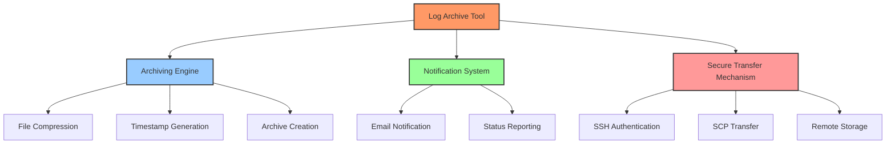
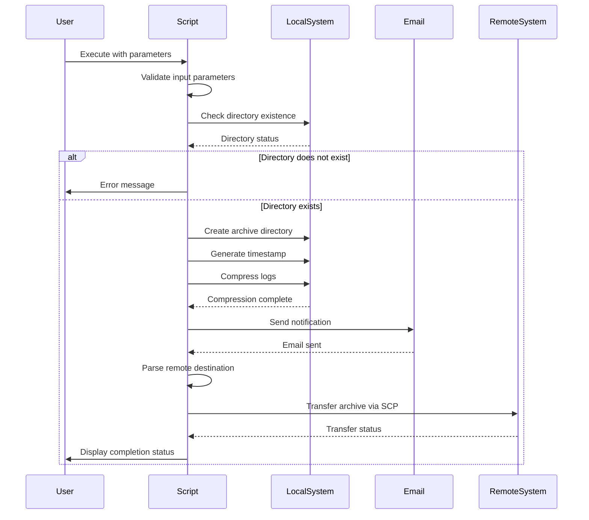
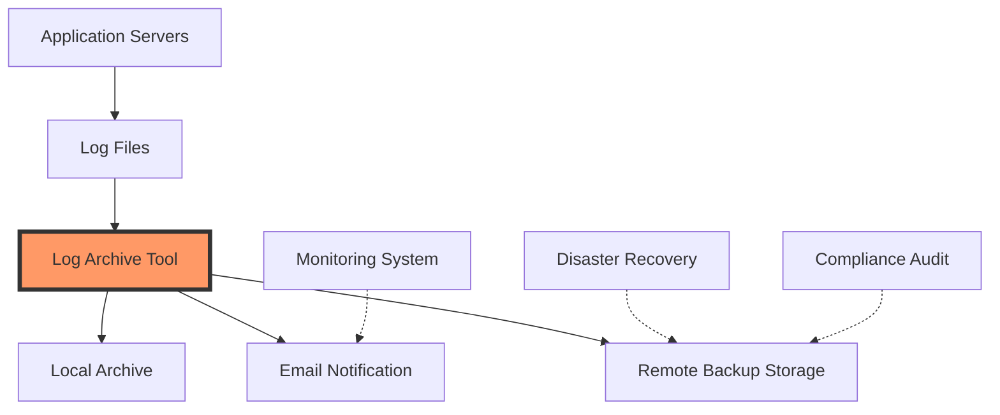
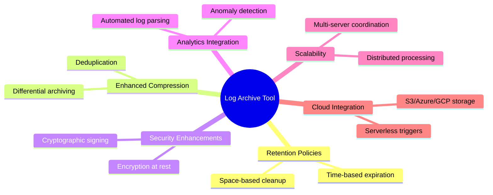

# Log Management and Archiving: A First Principles Deep Dive

## Introduction

Log files are the silent sentinels of our systems—recording events, errors, and activities that are crucial for troubleshooting, security auditing, and compliance. Yet, they present a unique challenge: they're essential to keep, but they consume resources and can quickly become unwieldy. In this blog post, we'll explore the fundamental principles behind efficient log management and how our Log Archive Tool addresses these challenges from first principles.

## Understanding Log Management from First Principles

### The Fundamental Problem Space

At its core, log management is about balancing several competing concerns:

1. **Information Preservation**: Maintaining historical records of system activities and events
2. **Resource Optimization**: Preventing log files from consuming excessive disk space
3. **Retrieval Efficiency**: Ensuring logs remain accessible when needed for analysis
4. **Security & Compliance**: Safeguarding sensitive information while meeting retention requirements

Rather than treating log management as a mundane operational task, we can approach it as an information lifecycle management problem with specific constraints and objectives.

## The Log Lifecycle

From a first principles perspective, logs undergo a predictable lifecycle:


Understanding this lifecycle reveals why most log management solutions fail: they focus on only one part of this cycle (usually creation and active use) without considering the entire information flow.

## Technical Architecture of the Log Archive Tool

Our Log Archive Tool approaches the problem holistically, addressing multiple stages of the log lifecycle in a single, cohesive solution:



This architecture separates concerns while ensuring that each component works in concert with the others. Let's explore each component in detail.

## Compression: Information Theory in Practice

From an information theory perspective, log files are ideal candidates for compression because they often contain repeated patterns and redundant information. Our tool leverages the gzip compression algorithm through tar:

```bash
sudo tar -czf "$ARCHIVE_DIR/$ARCHIVE_FILENAME" -C "$LOG_DIR" .
```

This single line represents a sophisticated compression process:
- The `-c` flag creates a new archive
- The `-z` flag applies gzip compression
- The `-f` flag specifies the output file

By compressing log files, we typically achieve compression ratios of 5:1 to 10:1, dramatically reducing storage requirements while preserving all information. This is not just a practical benefit but a fundamental application of information theory.

## Timestamp Generation: The Importance of Temporal Context

Time is a critical dimension in log analysis. Our tool generates unique timestamps using the command:

```bash
TIMESTAMP=$(date +"%Y%m%d_%H%M%S")
```

This format ensures:
1. **Chronological sorting**: Archives naturally sort in chronological order
2. **Unambiguous identification**: Each archive has a unique identifier
3. **Human readability**: The format is easily interpretable

From first principles, this timestamp serves as both an identifier and metadata, embedding temporal context directly into the artifact name.

## The Execution Flow: A Sequence-Based Approach

The tool's execution flow follows a logical sequence that minimizes failure points and ensures data integrity:



This sequence diagram reveals an important architectural principle: the tool handles error conditions early and proceeds only when preconditions are met, creating a robust execution path.

## Remote Backup: The Distributed Systems Approach

Perhaps the most sophisticated aspect of our tool is its approach to distributed storage. By leveraging SCP (Secure Copy Protocol), the tool ensures:

1. **Data Integrity**: Files are transferred without corruption
2. **Security**: All data is encrypted during transit
3. **Authentication**: SSH key-based authentication prevents unauthorized access

The implementation parses the remote destination string to extract the necessary components:

```bash
REMOTE_USER=$(echo "$REMOTE_BACKUP" | cut -d'@' -f1)
REMOTE_HOST=$(echo "$REMOTE_BACKUP" | cut -d'@' -f2 | cut -d':' -f1)
REMOTE_PATH=$(echo "$REMOTE_BACKUP" | cut -d':' -f2)
```

This parsing demonstrates a key principle in distributed systems: the separation of identity (user), location (host), and storage (path) as distinct components that together form a complete resource identifier.

## Notification System: Closing the Feedback Loop

From a cybernetic perspective, any effective system requires feedback loops. Our notification system serves this purpose:

```bash
{
    echo "Subject: Log Archive Notification"
    echo "To: $EMAIL"
    echo "Content-Type: text/plain"
    echo ""
    echo "Logs have been archived successfully on $(date)."
} | sendmail -t
```

This seemingly simple notification achieves several important functions:
1. It confirms successful operation
2. It provides an audit trail of archiving activities
3. It alerts administrators to potential issues if expected notifications don't arrive

## System Integration Architecture

When viewed as part of a broader system, our Log Archive Tool occupies a specific position in the infrastructure architecture:



This architectural view reveals how our tool serves as a critical junction between active systems and various downstream consumers of log data, from monitoring systems to compliance auditors.

## Security Considerations from First Principles

Security is not an add-on but a fundamental aspect of any log management solution. From first principles, we can identify several security requirements:

1. **Confidentiality**: Logs often contain sensitive information
2. **Integrity**: Logs must not be tampered with
3. **Availability**: Logs must be accessible when needed
4. **Non-repudiation**: The authenticity of logs must be verifiable

Our tool addresses these through:
- Executing with elevated permissions (`sudo`) to access protected logs
- Using SSH for secure, encrypted transfers
- Preserving file ownership and permissions during archiving
- Creating immutable archives with timestamps

## Future Extensions: Evolutionary Architecture

From our first principles analysis, several natural extensions emerge:



These extensions follow naturally from the core principles we've established, showing how a first principles approach enables organic, coherent system evolution.

## Conclusion: The Art of Log Management

By approaching log management from first principles, we've transformed what might seem like a mundane operational task into a sophisticated information lifecycle management solution. Our Log Archive Tool embodies these principles through:

1. **Efficiency**: Minimizing resource usage through compression
2. **Reliability**: Ensuring logs are preserved through multiple mechanisms
3. **Security**: Protecting sensitive information throughout the process
4. **Usability**: Simplifying operations with clear interfaces and feedback

The true art of systems engineering lies not in complexity but in finding elegant solutions to fundamental problems. By understanding the first principles of log management, we've created a tool that's both powerful and remarkably simple.

## About the Author

I'm a systems engineer passionate about infrastructure automation and applying first principles thinking to DevOps challenges. This project is part of the roadmap.sh learning path for server administration.

---

*For more information about log management best practices, visit [roadmap.sh/projects/log-archive-tool](https://roadmap.sh/projects/log-archive-tool)*
